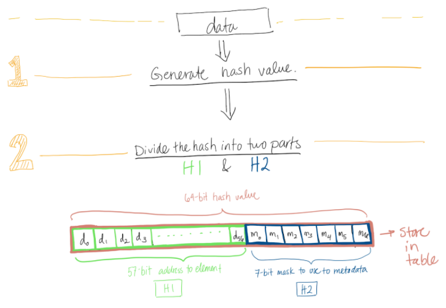
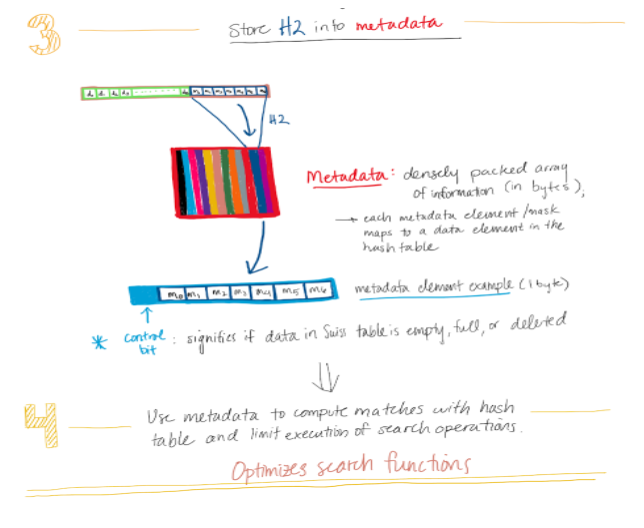
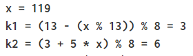
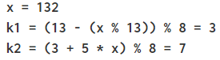
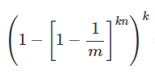

#### 
 CSE 373 AA | Research Group 28 | Winter 2021 

---
# 
 Memory and Cache-Friendly Algorithms 

 Exploration of Avenues for Efficiency 

  

_by Florence Atienza, Hudson Potts, and Claudia Valenta on March 15, 2021_

## Motivation

Computers are evolving exceedingly quickly, and two of the main goals of further innovation are to maximize available space and to increase efficiency.  There is only so much memory on a computer, so programs must be designed with this in mind.  As students in tech fields, we are all aware of the importance of data storage.  Being able to quickly access our class notes from our computer is no longer a luxury; it’s a necessity.  Using memory effectively is important to maintain computer efficiency, and one way to do so is by careful choice of data structures.  But how do we choose between data structures?   

Data structure analysis is something we’ve discussed extensively in CSE 373.  We learned many different ways to analyze our programming solutions, and memory usage is another avenue which can help us choose the most appropriate solution.  Being able to weigh the pros and cons of different data structures based on their memory allocation is important when using large data sets.  Looking back, our DNA Indexing project used a large data source, and some of the data structures we researched for this blog post would have been helpful in reducing the amount of memory we used in the project.   

Another thing we learned in this course, however, is the importance of balancing the drive for efficiency with an awareness of the repercussions that development might bring.  A program may be extremely memory efficient, but it’s practically worthless if it negatively impacts a group of people.  Through this blog post, we will be analyzing three data structures (Swiss Tables, Bloom Filters, and Suffix Arrays) through a memory lens, as well as an affordance analysis lens.

## Design

**_Swiss Tables_**

When storing data, unordered sets and maps are popular data structures for programmers to choose.  However, the resulting hash tables are expensive and not necessarily optimized to be as efficient as possible. Abseil tackles this problem with a specific family of hash tables which rethink conventional sets and maps: the Swiss table. Although they are not as widely used as the conventional hash table, Swiss tables result in faster find and insert operations.   

Swiss Tables, like hash tables, rely on a hash function, but the key difference lies in how the resulting 64-bit hash value stores information.

  

As shown by the graphic above, the Swiss’ table’s hash function subdivides the bits into a 57-bit section and a 7-bit section, each with a different purpose. The 57-bit hash value, called H1, refers to the element index in the table, and thus functions much like how a regular 64-bit hash value would. However, the remaining 7 bits (called H2) are repurposed for metadata.   

In Swiss tables, metadata is stored in a densely packed array of bytes (8-bit groups). For each group, 7 bits come from H2, but the 8th bit functions as the “control” which designates whether the element corresponding to the hash value still exists, is empty, or has been deleted1. This allows users to optimize their hash tables by first accessing the appropriate entry in the metadata and determining whether the element is located in a hash table bucket at all.   

To perform a search for an element, H1’s 57-bit value serves as an address to the beginning of a bucket in the hash table. H2 is a smaller address or “mask” located in the metadata which maps to the corresponding element in the table. Using Streaming SIMD Extensions (SSE) Instructions and the known mask, a user can compare and single-out matches in the table. The graphic below depicts the continued process.

  

Further operations can be performed to ensure accuracy and check edge cases, but the main idea of Swiss tables is to create a “top-level” overview of metadata filled with bytes. Each byte maps to an element in a large hashtable, but users would only need to perform expensive search operations if the top-bit of a byte specifies that the element is actually present. Consequently, Swiss tables constitute a faster, more efficient way to search large amounts of data.   

Although behavior is greatly improved, however, the swiss table does have a few limitations including the prerequisite that the hash function which generates the 64- bit value strategically “distributes entropy” across the bits2. Moreover, the implementation is not as widely adapted compared to conventional sets and maps.   

If one were to improve upon the Swiss table implementation, other points to consider include optimizing memory allocation and the move operation1. With more knowledge about SSE instructions and C++, one could avoid unnecessary allocation on the heap with a C++ function called emplace(). Similarly, one could remove the need to copy before moving data, instead moving when the data is constructed.

**_Bloom Filters_**

Bloom filters are a unique way to filter data in order to prevent expensive searches for keys that may not even be in a data set. The bloom filter itself doesn’t store any actual elements, it consists of a vector of bits that track whether or not a hash value is in the data set we’re looking at. But, in order to understand how all this is created and organized it’s important to step back and understand where everything begins for bloom filters, hashing.   
The first of the two main functions that bloom filters implements is **add**. When you add the bloom filter hashes the element being added to keep track of what elements (based on hash value) are in the set. Below we have an example of hashing to show you what hashing a value with **k** hash functions looks like (**k** being the number of hashes)5.

  

Once these two separate hash values are collected the next step is to add them to the bit array of size **m** (where **m** may be changed depending on the size of the set and **k** size). The bit array is what it sounds like, an array full of indexed bits, it’s important to note that while it’s empty at the start all of the bits are 0. The mod 8 (% 8) in the hash function above helps give us an index because in this example the size of the bit array was **m = 8**. The bits at index 3 and index 6 are then changed from 0 to 1. If we were to add another element it would be hashed as well and give us two hash values again that we would use to update the bit array. This process is repeated every time an element is added to the bloom filter. If we run into a situation where we add an element and the hash values that we get from it are indexes that are already 1 in the bit array, then they simply stay 1 and nothing changes. This feature of bloom filters comes into play in the next function **test**.   

Once we have added all the elements we want to the bit array using the bloom filter, we then can use the bloom filter to **test** if an element is contained in a data set. To test an element it first undergoes the same hashing we noted earlier, returning **k** hash values that we use as indexes for the bit array. Since we’re testing we’re looking to see if those index values are all 1’s or if any are 0’s. If any of those indexes are 0’s we know that the set doesn’t contain the element otherwise those indexes would all be 1’s already from **adding**. If all **k** indexes are 1 then we can determine that the element is **_“Probably in the set”_**. It’s very important to note that we don’t know for sure that an element is in the set based on all **k** indexes having a value of 1. This is due to the fact that elements hash values can overlap as shown here5.

  

132 has a hash value of 3 just like 119 also does. So for example if we added 119 and 4 using these hash functions, the bit array at indexes 1, 3, 6, 7 would all become a bit value of 1. If we then tested for 132 it would come back with all 1’s not because it’s in the set but because it’s hash value indexes are both 1.   

With this exception in mind we see that bloom filters don’t give a clear binary answer. Although we will get 1 of 2 responses we can’t walk away knowing for sure whether or not an element is in a set. One way companies have combated this issue is to run elements through multiple bloom filters before attempting to find it in a larger data set. While this strategy may increase the time spent on bloom filters it can often save much more time in the long run as the error of searching for an element that doesn’t exist decreases. The design of bloom filters may not be perfect but it does a good job saving time that would otherwise be wasted by filtering the data.

**_Suffix Arrays_**

Suffix arrays are another creative way to use less memory in a program3.  These are especially helpful when a problem relates to finding subsequences within a given String.  The main idea is to index a String and store integers referring to an alphabetized list of each suffix of the original String.  It seems a little complex at first, so let’s break it down.   

First, you want to assign an index to each character in the String, like shown below.

  

You now have n suffixes of the given String, n being the length of the String.  You should then order these suffixes alphabetically, making sure to keep the original indexes with the same suffixes.

  

To finally build the suffix array, create a new array of length n and in each index, place the number of the suffix in that placement alphabetically.  For example, “d” is the 1st suffix alphabetically, and its index (from the original ordering of the String) is 4, so you would add 4 to the 0th index of the suffix array.  After adding in the remaining suffix values, your suffix array is complete!  

  

Storing only integers as the data values allows you to easily access certain suffixes within the original String without needing to store more than one data value at each index of the array.  To access a suffix, you simply need to access the desired index in the array and use that to pull out the suffix, which all occurs in constant time (to be discussed in more detail later).   

There are other implementations similar to suffix arrays, as well.  Suffix trees are another popular way to access suffixes of a String4.  Rather than storing indexes in an array format, you can place them as leaf nodes of a tree.  To build up each specific suffix of the tree, you start with a null root node, and each branch of the tree leading to a leaf node builds up one suffix, and returns the index that suffix starts with.  Visually, it looks like the figure below.

  

This is an example of a compressed tree, which minimizes the number of nodes in a tree by combining any nodes with only one child.  (This is another way to conserve memory used within a program.)  Traversing the tree, you can see that each path along the tree results in one number, and thus one suffix of the original String.  This data structure can find any suffix in at most q time, q being the length of the query.  This is because the tree structure allows us to only need to make q character comparisons.  We will only ever go down one branch at a time, and thus we only need to make one comparison for each level of the tree.

## Analysis

**_Swiss Tables_**

In terms of asymptotic analysis of Swiss tables, they still exhibit similar behavior as any hashtable, just in a more efficient manner. For example, looking up an element in most hashmaps used in industry and in practice takes constant O(1) time. Searching Swiss tables also results in a constant runtime but at a faster rate comparatively. This is because Swiss Tables have top-level metadata to control whether a search command should be executed.   

Considering the affordance analysis of Swiss tables, it is noteworthy that this implementation was developed by Google. As a result, the corporate context of this technology raises multiple questions. How accessible is this implementation apart from the general documentation to non-Google employees? Is it available on open source channels? Assuming that Swiss tables become more widespread within this company and others,  what are the company’s plans for that freed-up space? How transparent are those processes?   

Because the Swiss table is a relatively newer implementation of the conventional hash table, a certain optimism accompanies the technology, immediately followed by an asterisk: will this technology be implemented on a larger scale and if so, who will that benefit? Although the answers to these questions are unclear, they are nonetheless important to consider when analyzing any new implementation.

**_Bloom Filters_**

Bloom filters have two main functions that we can look at the asymptotic analysis of, **test** and **add**6. While other functions can be implemented into bloom filters (such as removal), we can’t do this without adding extensions to the bloom filter such as counting filters. The basic bloom filter only allows us the two operations listed above.   

As mentioned earlier both **test** and **add** use a very similar process of hashing, once the hashing is performed **add** is setting the value of the index to 1 which is a constant Θ(1) runtime; and **test** is getting the values at the indexes which is also a constant Θ(1) runtime. So the only other runtime we need to look at is the hashing. For the hashing function we know it to be O(k) which is independent from the size of the set. The **k** represents the number of hash functions (and bits returned) for each element. So if an element is broken down by 2 hash functions and represented by 2 bits, then the runtime would be O(2) giving us a constant runtime. Running a bloom filter of a constant runtime can save a lot of runtime compared to doing something such as a costly disk search making bloom filters highly useful.   

One other way we can analyze bloom filters is looking at the rate of false positives (when it states an element is probably in the set but it actually isn’t). We can use the equation below to determine the percentage of time we will get a false positive when testing an element5.

  

The **k** stands for the amount of hashing functions being used as mentioned earlier. The **m** stands for the size of the bit array as mentioned earlier. And finally the **n** stands for the amount of elements added to the bloom filter. As an example if we had **k = 2, m = 8,** and **n = 3** we would have a false positive approximately **30%** of the time. While 30% may seem high this number can be decreased greatly by increasing the size of **m**. We also must state again that bloom filters are fast ways to filter data to prevent costly searches. In this case efficiency is valued more than accuracy, but with that quantity over quality mindset it definitely leaves me to wonder if certain companies or organizations would shy away from bloom filters. Or at the very least consider using more than just a bloom filter if they value more accuracy at the cost of efficiency.

**_Suffix Arrays_**

Since suffix arrays store integer values that refer to indexes in the original string, the asymptotic runtime of looking through an array to find a given suffix depends only on the method of looking through the array.  If we were to use linear search by looping over each element of the array, the worst-case runtime would be O(N) since we might have to loop until the last element.  Calling suffixArray[i] runs in constant time, and isolating the suffix starting at that index of the String also takes constant time, proving the runtime only depends on the search method.  One way to improve this is to use binary search.  Using binary search, the runtime would be reduced to O(log(N)), which is significantly more efficient.   

Suffix trees have an even quicker asymptotic runtime.  Finding any suffix in a suffix tree takes at most q time, q being the amount of letters in the suffix.  This is because each suffix exists in a different branch of the tree, so you only need to make q character comparisons between branches.  Our hound example from above is an example of a best case, where each suffix starts with different letters and has no repeated letters throughout, meaning each suffix is its own branch of the tree.  For this case, the runtime is even faster than q comparisons.  If the suffixes all started with the same letter, it would be closer to q comparisons (the worst case).   

Through an affordance analysis lens, suffix arrays seem to be pretty airtight.  By storing the suffixes alphabetically, there is no contextual ranking of suffixes that could lead to bias.  Ties are broken alphabetically as well, meaning the only ranking of suffixes is derived from the alphabet.  This is a pretty bare bones data structure in that it doesn’t make quality based choices based on human input, which I think shows that it’s an unbiased data structure.  Having data structures like these that only rank inputs based on a set system (such as the alphabet) leave less room for interpreted bias.

## Learning Target

Assuming we use a sort of chaining hash table to solve the issue of collisions, the resulting data structure would resemble the figure below with M buckets and N elements.

  

The runtime of searching through this type of data structure would be O(logM(N)).  Let’s explore how we got to this answer.   

To make things easier to picture, we’ll set the number of buckets M to be 5.  In the worst case, the N elements would all be inserted into the same bucket each level, meaning each element is in its own bucket as well as its own level, as shown below with an N of 3.

  

To find the worst case element, we would have to look through all the levels until the very last one.  With 3 elements, this means we are looking through 3 levels (or N, if generalizing).  Each level, however, we are only looking through one of the five available buckets.  This means that at each level, we are essentially dividing our work by 5 by discarding 4 buckets.  The log function represents this type of work division very well, which is how we settled on a runtime of logM(N).  In the worst case, we divide our work by M buckets each level, and have to search through N levels.  In the best case, however, the element we are searching for is in the first bucket on the first level (N0 in our example).  This type of search would result in a constant runtime O(1) since we would just be accessing the very first element we see.  

## Conclusion

As society increasingly relies on data processing for more facets of life, it follows that there exists a growing need for memory and - for that matter - memory efficiency. As a result, no matter what implementation is deemed optimal for a technology in development, it is important to approach the effort with a philosophy we learned in CSE 373: we must balance 1) the drive for more efficient systems with 2) an awareness of that technology’s repercussions to different communities. For more on this analysis on social responsibility relating to technology, see our memo linked below.

  

## Citations

1. Benzaquen, Sam, et al. “Swiss Tables Design Notes.” Abseil.io, 2017, https://abseil.io/about/design/swisstables#credits. Accessed 12 Mar. 2021.
2. Kulukundis, Matt. “Designing a Fast, Efficient, Cache-friendly Hash Table, Step by Step”. YouTube, uploaded by  CppCon, 26 October, 2017, https://www.youtube.com/watch?v=ncHmEUmJZf4.
3. University of California, San Diego. “Advanced Data Structures: Suffix Arrays.” YouTube, uploaded by Niema Moshiri, 27 Apr. 2020, www.youtube.com/watch?v=IzMxbboPcqQ.
4. Skiena, Steven. “Suffix Trees & Arrays.” Stony Brook Algorithm Repository, www.algorist.com/problems/Suffix_Trees_and_Arrays.html.
5. “CS106B Esoteric Data Structures.” Web.stanford.edu, web.stanford.edu/class/archive/cs/cs106b/cs106b.1206/lectures/esoteric-data-structures/#bloom-filters. Accessed 15 Mar. 2021.
6. “Bloom Filters.” Www.jasondavies.com, www.jasondavies.com/bloomfilter/. Accessed 15 Mar. 2021.

---

University of Washington  
3800 E Stevens Way NE  
Seattle, WA 98195

