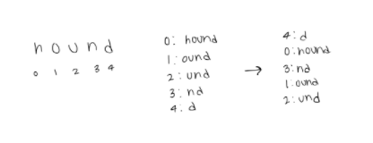
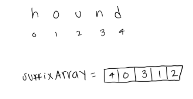
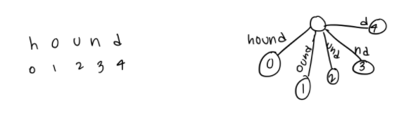
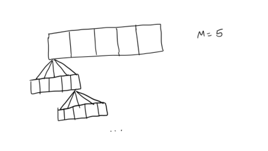
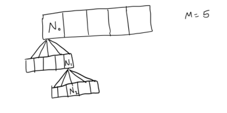

#### 
 CSE 373 AA | Research Group 28 | Winter 2021 

---
# 
 Memory and Cache-Friendly Algorithms 

 Exploration of Avenues for Efficiency 

_by Florence Atienza, Hudson Potts, and Claudia Valenta on March 15, 2021_

## Motivation

Computers are evolving exceedingly quickly, and one of the main goals of further innovation is to maximize available space and to increase efficiency.  There is only so much memory on a computer, so programs must be designed with this in mind.  As students in tech fields, we are all aware of the importance of data storage.  Being able to quickly access our class notes from our computer is no longer a luxury; it’s a necessity.  Using memory effectively is important to maintain computer efficiency, and one way to do so is by careful choice of data structures.  But how do we choose between data structures?  
Data structure analysis is something we’ve discussed extensively in CSE 373.  We learned many different ways to analyze our programming solutions, and memory usage is another that can help us choose the most appropriate solution.  Being able to weigh the pros and cons of different data structures based on their memory allocation is important when using large data sets.  Looking back, our DNA Indexing project used a large data source, and some of the data structures we researched for this blog post would have been helpful in reducing the amount of memory we used in the project.
Another thing we learned in this course, however, is the importance of balancing the drive for efficiency with an awareness of the repercussions that development might bring.  A program may be extremely memory efficient, but it’s practically worthless if it negatively impacts a group of people.  Through this blog post, we will be analyzing three data structures (Swiss Tables, Bloom Filters, and Suffix Arrays) through a memory lens, as well as an affordance analysis lens.

## Design

**_Swiss Tables_**

**_Bloom Filters_**

**_Suffix Arrays_**

## Analysis

**_Swiss Tables_**

**_Bloom Filters_**

**_Suffix Arrays_**

## Learning Target

## Conclusion

As society increasingly relies on data processing for more facets of life, it follows that there exists a growing need for memory and - for that matter - memory efficiency. As a result, no matter what implementation is deemed optimal for a technology in development, it is important to approach the effort with a philosophy we learned in CSE 373: we must balance 1) the drive for more efficient systems with 2) an awareness of that technology’s repercussions to different communities. For more on this analysis on social responsibility relating to technology, see our memo linked below.

## Citations

1. Skiena, Steven. “Suffix Trees & Arrays.” Stony Brook Algorithm Repository, www.algorist.com/problems/Suffix_Trees_and_Arrays.html.
2. University of California, San Diego. “Advanced Data Structures: Suffix Arrays.” YouTube, uploaded by Niema Moshiri, 27 Apr. 2020, www.youtube.com/watch?v=IzMxbboPcqQ.

---

University of Washington  
3800 E Stevens Way NE  
Seattle, WA 98195

